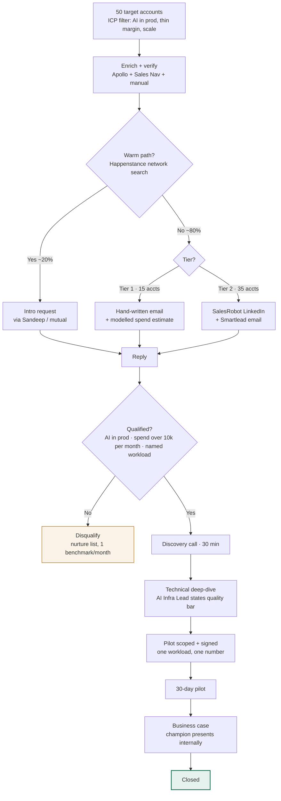
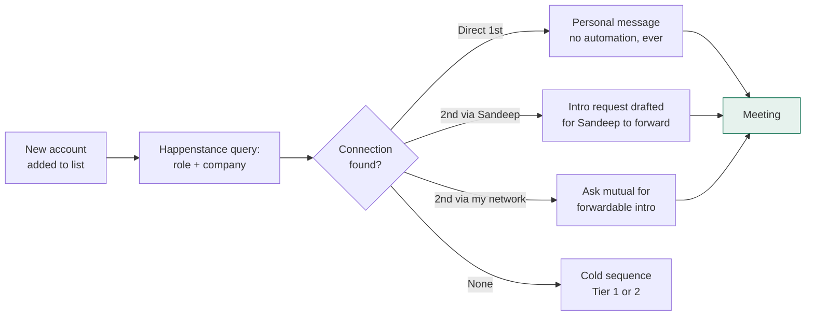
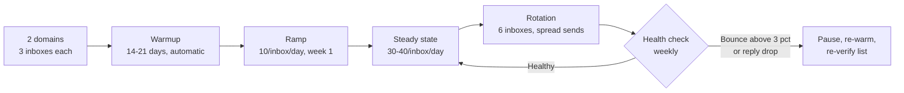
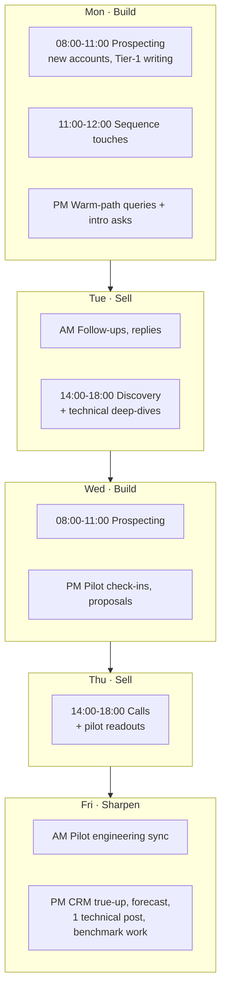
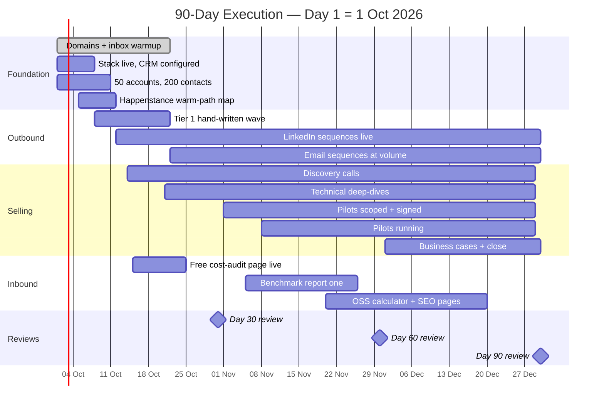
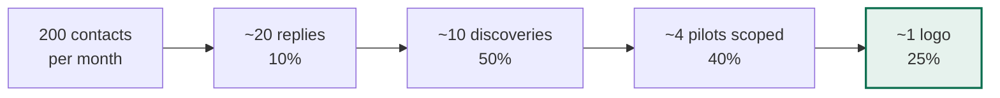
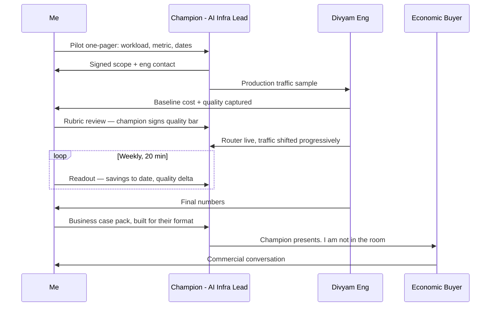

# Divyam.AI — 90-Day Execution Plan

**Outbound machine, tool stack, weekly workflows, and the numbers I'd report**
Saurabh Navale · 24 September 2026 · Companion to the GTM Blueprint + Sales Playbook

> Notion note: the diagrams are Mermaid. Paste this file as Markdown, or create a `/code` block, set the language to **Mermaid**, and paste the block contents — Notion renders them inline.
> Day 1 is assumed to be **1 October 2026**. Shift the dates, not the sequence.

---

## 1. The Whole Machine, One Diagram

**The design decision:** warm path is checked **before** any cold sequence runs. A Happenstance hit converts several times better than the best cold email I can write, and it costs one query.

---

## 2. Tool Stack & Budget

Bootstrapped constraint: **no ad spend, no data vendor contracts.** Everything below is month-to-month and cancellable.

| Tool | Job in the motion | Cost / month | Why this one |
|---|---|---|---|
| **Happenstance** | Network search — "who do we know at Swiggy in platform eng?" Warm-path discovery across Gmail, LinkedIn, calendar | **$30**/user | Checked first on every account. Warm beats cold at any volume. SOC 2, API access |
| **SalesRobot** | LinkedIn automation for Tier 2 — connection + follow-up sequences, AI icebreakers from recent posts, built-in mini-CRM | **$59–99** | Safe-mode throttling and adaptive limits. A restricted LinkedIn account costs more than the subscription |
| **Smartlead** | Cold email infra — unlimited inboxes, unlimited warmup, rotation across domains | **$39–94** | Unlimited mailboxes on every tier is the whole reason. Warmup included |
| **LinkedIn Sales Navigator** | Account and persona mapping, trigger events, hiring signals | **~$99** | Non-negotiable for Indian platform-eng orgs — org charts aren't in any database |
| **Apollo** | Contact discovery + enrichment baseline | **$49–79**/user | Start here; assume patchy India coverage and verify manually |
| **Secondary domains + inboxes** | 2 domains × 3 inboxes, never the primary domain | **~$15** | Reputation firewall. The main domain never sends cold |
| **Email verification** | Bounce control before every send | **~$20** | Above 3% bounce, deliverability collapses |
| **CRM** | HubSpot free tier, or Attio | **$0–29** | Stages and required fields matter more than the logo |
| | **Total** | **≈ $320–465/mo (₹27k–39k)** | Against a ₹0 media budget |

> **Deliberate omission:** Clay at $185+/month is the obvious upgrade for waterfall enrichment. I'd defer it to month 3 and only if manual verification proves to be the bottleneck. At 200 contacts/month, my time is cheaper than the subscription.

---

## 3. Channel Workflows

### 3.1 Warm path first — Happenstance

**Rule:** a Happenstance hit **never** enters an automated sequence. Burning a warm path with a templated message is the most expensive mistake in this plan.

**Sandeep's ask, made concrete:** I'd run the network query for all 50 accounts in week 1, then bring him a **ranked list of ~10 intro requests with the message pre-drafted**. His cost is forwarding an email, not thinking of names.

### 3.2 LinkedIn — SalesRobot, Tier 2

| Step | Day | Action | Volume ceiling |
|---|---|---|---|
| 1 | D1 | Connection request, **no note** for cold profiles | 20–25/day |
| 2 | D3 after accept | Value message — one observation about their AI feature. **No ask** | — |
| 3 | D6 | The disqualifying question | — |
| 4 | D10 | Artifact: MakeMyTrip teardown or a benchmark | — |
| 5 | D14 | Soft close or exit to nurture | — |

**Safety discipline:** stay at 20–25 connects/day even though the tool allows more; warm the account for 2 weeks before automating; never run SalesRobot and manual outreach on the same profile the same day. A restricted profile costs a month of pipeline.

**Where AI personalisation helps and where it doesn't:** SalesRobot's icebreakers from recent posts are fine for step 1. Steps 2 and 3 carry a technical claim and get written by me — an AI icebreaker that misreads an engineering post is worse than no personalisation at all.

### 3.3 Email — Smartlead

Capacity at steady state: **6 inboxes × 35/day ≈ 200 sends/day**, far beyond what 50 accounts need. The constraint is deliberately *list quality*, not send volume.

### 3.4 Tier 1 — no automation at all

15 accounts. Hand-written, one at a time, with a modelled inference-spend estimate in the first email. ~25 minutes each. These are the accounts that become the case studies.

---

## 4. Weekly Operating Rhythm

**Daily floor:** 25 touches · 5 new accounts researched · inbound answered inside 4 working hours · no deal left in a stage past its clock.

---

## 5. The 90 Days

### Week by week

| Week | Focus | Output by Friday | Leading metric |
|---|---|---|---|
| **1** | Stack + list | Tools live, CRM stages configured, domains warming, 50 accounts identified | 50 accounts, 0 sends |
| **2** | Data + warm paths | 200 contacts verified and tiered; Happenstance map done; **10 intro requests to Sandeep, pre-drafted** | 200 contacts |
| **3** | Tier-1 wave | 15 hand-written emails with spend models; LinkedIn sequences start | First replies |
| **4** | Volume on | Email sequences live post-warmup; all 5 touches running | **≥5 discovery calls** |
| **5** | Convert | Technical deep-dives; first pilot scoping docs drafted | 2 deep-dives |
| **6** | First pilots | **1–2 pilots signed**; cost-audit page live | 1 signed pilot |
| **7** | Run + refine | Baselines captured; ICP tightened on evidence — double down on the replying segment | Pilot baseline set |
| **8** | Second wave | Refreshed list for segments that responded; benchmark #1 drafted | 15 total discos |
| **9** | Pilot readouts | First ₹-saved number produced; champion prepped to present | **First verified saving** |
| **10** | Business case | Procurement + security started on pilot 1; benchmark #1 published | Security review opened |
| **11** | Close motion | Pricing negotiated against a real number; pilots 2–3 in readout | 1st close in sight |
| **12** | Close | **First logo signed**; case study drafted | 1 logo |
| **13** | Systematise | POC runbook written; pipeline for Q2 built; 3 logos or a clear read on why not | **3 logos** |

---

## 6. Funnel Math, With Capacity

| Stage | Monthly | 90-day | Assumption being made |
|---|---|---|---|
| Contacts worked | 200 | 600 | 50 accounts refreshed monthly |
| Replies | ~20 | ~60 | 10% — achievable only because Tier 1 is hand-written |
| Discoveries | ~10 | ~30 | 50% reply→meeting, because the reply is to a question, not a pitch |
| Pilots scoped | ~4 | ~12 | 40% — gated by engineering capacity, not demand |
| **Closed** | ~1 | **3** | 25% pilot→close, conservative because the pilot produces a number |

**Where this plan breaks first:** pilot capacity. If engineering can only support 2 concurrent pilots, the honest 90-day number is 2 logos, not 3 — and I'd rather pace outbound than stack up pilots we can't service. **That is question 2 for you.**

---

## 7. Pilot Workflow — Who Does What

**The rule that makes this work:** the champion presents, not me. A number defended by their own engineer survives a budget meeting. A vendor deck does not.

---

## 8. Risk Register

| Risk | Signal it's happening | Mitigation, pre-planned |
|---|---|---|
| **LinkedIn restriction** | Warning, or invites stop landing | Stay at 20–25/day; warm 2 weeks; pause automation for 7 days |
| **Domain burn** | Bounce > 3%, replies fall off a cliff | Secondary domains only; verify before every send; re-warm on trigger |
| **India data quality** | Apollo returns stale titles for platform-eng roles | Sales Nav as source of truth; manual verify Tier 1 100%, Tier 2 sampled |
| **Pilot capacity ceiling** | More pilots scoped than engineering can staff | Pace outbound; queue pilots with dates rather than starting them badly |
| **BFSI cycle length** | Security review runs past 6 weeks | Start security questionnaire at pilot kickoff, not at close |
| **No warm paths found** | Happenstance returns nothing across the list | Fall back to community-led credibility — benchmarks and OSS, which I'd start in parallel anyway |
| **Wrong ICP** | Replies cluster in a segment I ranked low | Week 7 is the scheduled pivot point, decided on reply data, not instinct |

---

## 9. What I'd Show You at Each Review

| Review | The artifact | The question I'd expect |
|---|---|---|
| **Day 30** | Account map, reply-rate by segment and persona, 5+ discoveries booked, warm-path results | "Is the message landing, and with whom?" |
| **Day 60** | 3 pilots running with signed scopes, first baseline numbers, ICP narrowed to 2 segments | "Are the pilots producing numbers, or activity?" |
| **Day 90** | 3 logos, one case study, POC runbook, Q2 pipeline, validated pricing from 3 real negotiations | "Can the next AE run this without you?" |

**The one number I'd put on the wall:** *accounts where I can state their monthly inference spend.* Everything downstream follows it — it is the difference between a pipeline and a list.

---

### The six questions, still open
1. **Pricing** — share of verified savings, platform fee, or per-token?
2. **Pilot capacity** — how many concurrent pilots can engineering genuinely support? *This plan's ceiling.*
3. **Product** — does the router work per-step inside agent workflows, or only per-prompt?
4. **Trust** — security questionnaire pack or SOC 2 path: build, buy, or route around with air-gap?
5. **Moat** — when Portkey ships evidence-based routing, what still can't they copy?
6. **Win at Day 90** — logos, revenue, or a repeatable motion?
