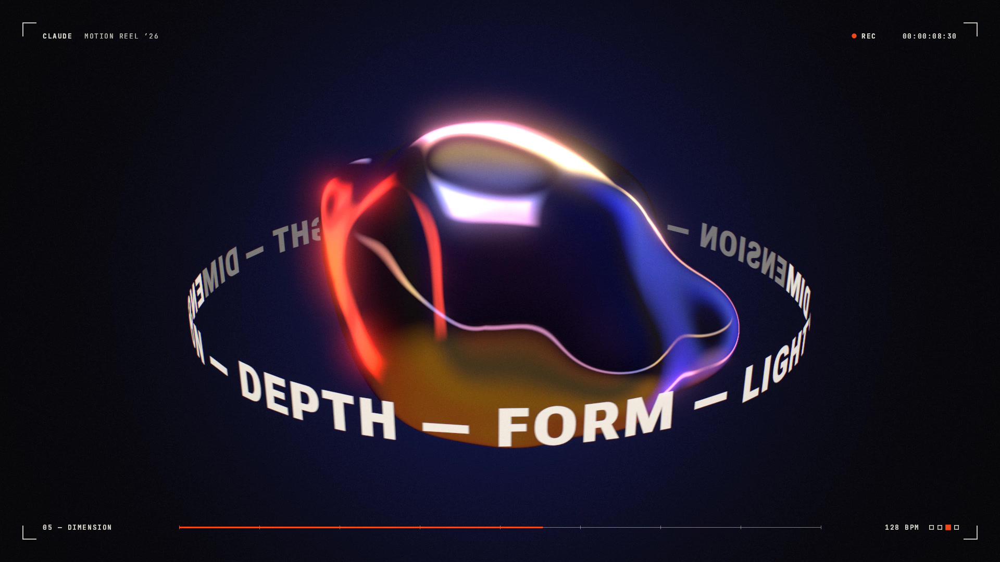
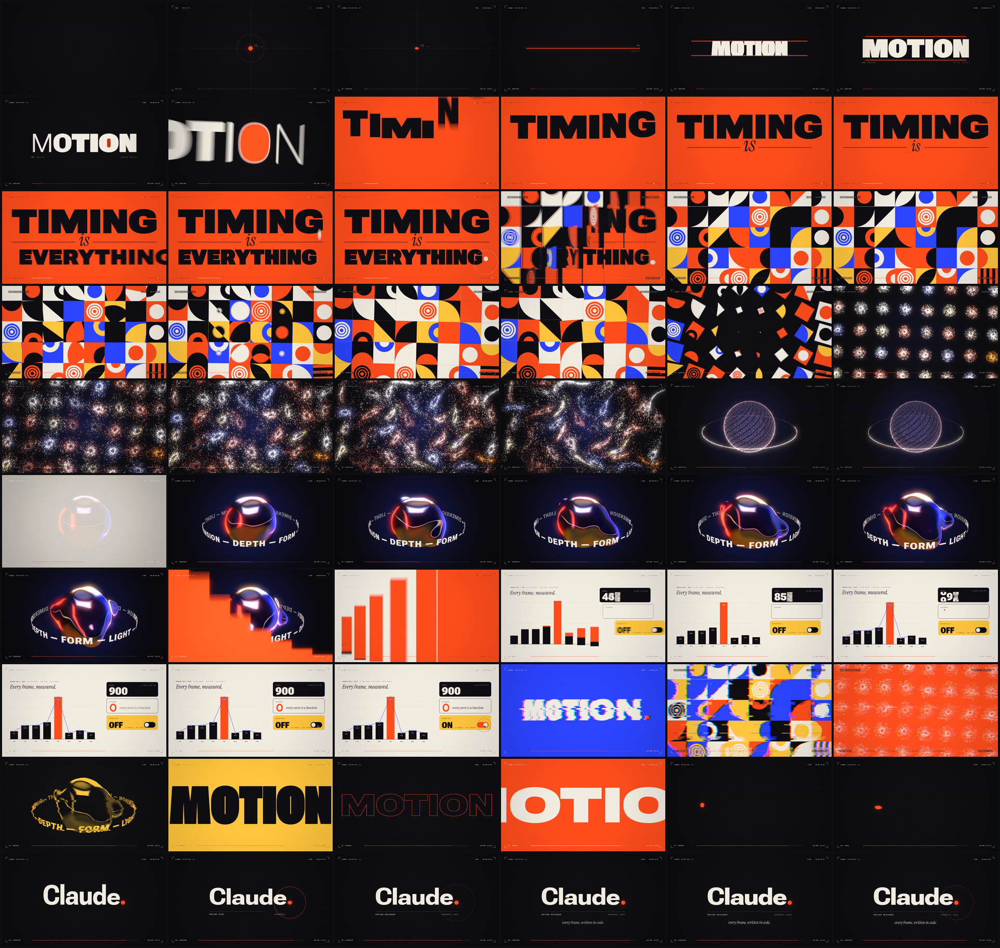
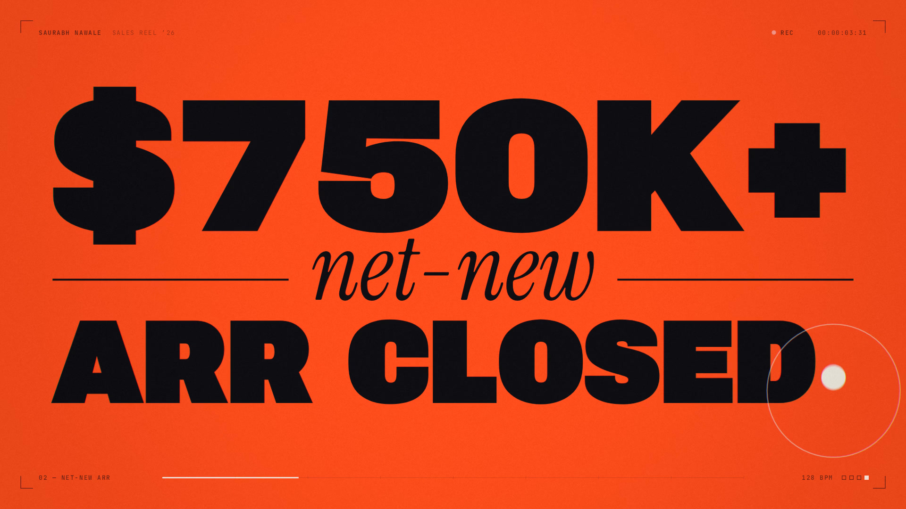
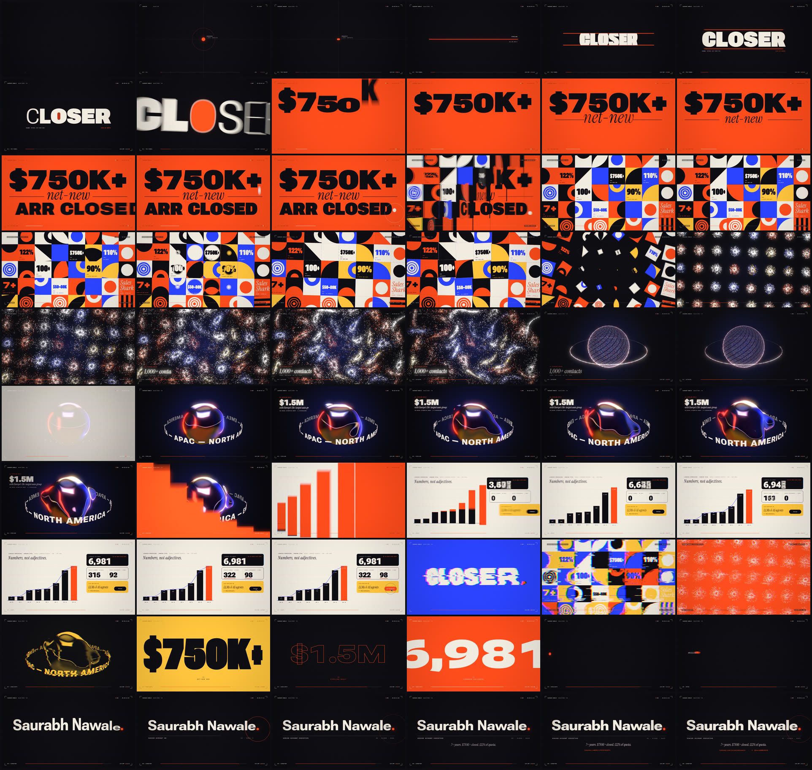

# Claude — Motion Reel 2026

A 15-second motion-design showreel (1920×1080, 60 fps, with sound). The whole
piece is generated by code: every frame and every sound in it.

[](showreel.mp4)

**▶ [`showreel.mp4`](showreel.mp4)**: 1920×1080, 60 fps, 900 frames, H.264 + AAC, 27 MB.

No keyframes, no footage, no samples. Each curve is a function of time. The
typography is real vector outlines interpolated from a variable font. The
chrome is raymarched. The particles are simulated. The soundtrack is
synthesised from oscillators and noise. It all sits on one musical grid:
**128 BPM, 8 bars = exactly 15.000 s**, so every cut lands on a beat and
every visual hit has a sound.

The same code also renders a personalised cut, a sales reel for Saurabh
Nawale. See [*Personalised cut*](#personalised-cut) below.

## The shots

| # | Time | Shot | What happens | Craft on show |
|---|------|------|--------------|---------------|
| 01 | 0.00 | **Ignition** | A point pops, stretches into a line, the line splits open like a slit to reveal *MOTION*, a weight ripple runs through it, and the camera dives through the counter of the "O". | *Point and Line to Plane* as a title sequence, variable-font width/weight animation, portal transition |
| 02 | 1.88 | **Kinetic type** | *TIMING / is / EVERYTHING.* — one word per beat, each with its own entrance: squash-and-stretch drop, elastic pop, an accordion slide that compresses on the width axis, a bouncing full stop. | Animation principles, width-axis justification, editorial layout |
| 03 | 3.75 | **Geometry** | The type is cut into 240 px tiles that flip over in perspective. Their backs are a modern-Bauhaus grid: quarter turns, radial colour inversions, then every plane spins down into a point. | Shader tile-flip transition, systemised pattern design, wave choreography |
| 04 | 5.63 | **Particles** | 20,000 particles burst out of those points like fireworks, get pulled into a galaxy-like vortex, then settle into a rotating 3D sphere. One particle in six orbits on a tilted ring. | Deterministic 240 Hz simulation, curl noise, additive light, match-cut setup |
| 05 | 7.50 | **Dimension** | The sphere turns to liquid chrome, a raymarched metaball with thin-film iridescence and a procedural studio in its reflections. The particle ring becomes a ring of type orbiting in true perspective. | Raymarching, PBR-ish shading, 3D type projected in 2D, occlusion layering |
| 06 | 9.38 | **Data** | A flame staircase wipes the chrome away, and its columns settle into a bar chart of *this reel's own render cost*. An odometer counts 900 frames, a zero draws itself as a ring, and a cursor flips motion blur on exactly on the beat. | UI/data motion, odometer, draw-on strokes, real data |
| 07 | 11.25 | **Montage** | The build. Recaps in new colourways on 8th notes (duotone chrome, glitch cuts), then *MOTION* cycles through six typographic voices on 16ths, then silence: the point from frame one, alone on black. | Rhythm editing, duotone grading, glitch transitions |
| 08 | 13.13 | **Signature** | On the last downbeat the point travels right and *writes the name* as it passes, then lands as the full stop. | Bookended narrative, sonic logo |

The chart in shot 06 is real. Those are the per-shot frame times this renderer
measured (`node tools/render.mjs bench`). The raymarched chrome is the
expensive one.



<a id="personalised-cut"></a>
## Personalised cut: Saurabh Nawale, Sales Reel 2026

[](saurabh-nawale-reel.mp4)

**▶ [`saurabh-nawale-reel.mp4`](saurabh-nawale-reel.mp4)**: 1920×1080, 60 fps, 900 frames, H.264 + AAC, 28 MB.

This cut reuses the engine, choreography and soundtrack. A content profile
(`src/profile.js`) supplies every word and number on screen, so the numbers
land on the beats the motion was designed around.

| # | Time | Shot | On screen |
|---|------|------|-----------|
| 01 | 0.00 | **The funnel** | The point, line and word become a sales funnel. *PROSPECT: 1,000+ contacts*, then *PIPELINE* counting up to $1.5M as the line grows, then *CLOSER*: $750K+ net-new ARR, 122% of quota. The camera dives through the "O". |
| 02 | 1.88 | **Net-new ARR** | *$750K+ / net-new / ARR CLOSED.* One line per beat. |
| 03 | 3.75 | **Quota** | Eight stat tiles set into the Bauhaus grid: 122% Q2 quota, 110% Q4 quota, $750K+ net-new ARR, 100+ accounts, 90% C-suite win rate, 7+ years in B2B sales, $50–80K ACV on AI agentic deals, and the Sales Shark award. |
| 04 | 5.63 | **Outbound** | The particle burst becomes the outbound engine: 1,000+ contacts, scored and worked in waves across NA, EU and LATAM. |
| 05 | 7.50 | **Pipeline** | $1.5M pipeline built with Van Mossel Automotive Group, Europe's 5th-largest auto group, across 6+ stakeholders. *EMEA · APAC · NORTH AMERICA* orbits the chrome. |
| 06 | 9.38 | **Reach** | LinkedIn post impressions as a running total since June (2,145). An odometer counts 6,981 followers (+1% week over week), with 322 profile viewers in 90 days and 98 search appearances in a week. A card for X (@Saurabhnawale_, writing on LLMs and AI agents) has its Follow button clicked on the beat. |
| 07 | 11.25 | **Highlights** | $750K+ · 122% · $1.5M · 100+ · 6,981 · 7+ YRS on 16th notes, each with its caption. |
| 08 | 13.13 | **Signature** | *Saurabh Nawale.* Senior Account Executive, AI · Cloud · SaaS. *7+ years. $750K+ closed. 122% of quota.* linkedin.com/in/saurabhnawale. |

Every figure comes from one of three places: the September 2026 résumé, the
LinkedIn analytics dashboard (September 2026), or LinkedIn's weekly digest
emails (June to September 2026). The impressions chart adds up the weekly
digests, so it shows accumulated reach rather than a week-over-week change.



## How it's built

```
src/
  config.js        canvas, tempo grid, palette
  math.js          easing library, cubic-bezier solver, springs, seeded noise
  type.js          variable-font outline engine (per-glyph weight/width)
  engine.js        CPU 2D layers + WebGL2 compositing, motion-blur accumulation, post
  gl.js            tiny WebGL2 toolkit
  profile.js       content profiles: every word and number on screen
  reel.js          the conductor: shots, transitions, camera hits, cut-aware shutter
  hud.js           viewfinder overlay (timecode, slate, tempo pips)
  transitions.js   tile flip, duotone, glitch shaders
  scenes/          one module per shot
tools/
  build_glyphs.py  fontTools + HarfBuzz: outlines + kerning → assets/glyphs/*.json
  soundtrack.py    numpy/scipy synthesiser → soundtrack.wav
  render.mjs       headless-Chromium render farm → ffmpeg → showreel.mp4
```

- **Variable type as geometry.** Roboto Flex's weight/width deltas only break
  at wght 100/400/700/1000 and wdth 25/100/151 (at opsz 144). The outlines are
  sampled at those 12 masters, so bilinear interpolation in the browser is
  *exact*. Every glyph can carry its own axes on every frame, drawn as real
  paths, with variation-aware kerning from HarfBuzz.
- **Deterministic frames.** Nothing depends on wall-clock time. `renderFrame(f)`
  is a pure function of the frame number, so frames can be rendered in any
  order, in parallel, and reproducibly.
- **True motion blur.** Each output frame averages 5–14 sub-frames across a
  180° shutter in a 32-bit float buffer, in linear light. The shutter is
  *cut-aware*: it never exposes across a hard edit, just as a real camera
  wouldn't.
- **Post.** Dual-filter bloom, radial lens chromatic aberration that kicks on
  impacts, camera shake/punch on the beat, vignette, animated film grain and
  triangular dither so gradients never band.
- **Sound.** Kick, clap, hats, off-beat bass, supersaw chords, FM bells,
  risers, whooshes, glitch stutters and a sidechained groove are all
  synthesised. Every visual event is scored: the point's blip, clock ticks
  under *TIMING*, a card-shuffle for the tile flip, the particle sparkle,
  the chrome's metallic hit, odometer clicks, the toggle and the sonic logo.
  Mastered to −15 LUFS integrated, −1 dBFS peak.

## Rendering it yourself

Requirements: Node 18+, Python 3.10+ (`numpy scipy fonttools brotli
uharfbuzz`), ffmpeg (or `pip install imageio-ffmpeg`), and a Chromium that
Playwright can drive.

```bash
cd showreel
npm install                          # playwright + ws
npm run glyphs                       # only if you change fonts/charset
npm run audio                        # -> soundtrack.wav
npm run preview                      # live preview: http://127.0.0.1:8080/index.html
node tools/render.mjs sheet          # quick contact sheet  -> out/sheet.png
node tools/render.mjs video --res 0.5 --samples 2   # fast draft -> out/preview.mp4
npm run render                       # full quality -> showreel.mp4
node tools/render.mjs video --profile saurabh       # full quality -> saurabh-nawale-reel.mp4
```

`stills`, `sheet`, `video` and `bench` take `--profile <id>` (default
`claude`). In the live preview, pick it in the URL: `index.html?profile=saurabh`.

`showreel.mp4` was rendered from commit `f1e235b`, before profiles existed.
Rendering the `claude` profile from later commits gives the same film with
three small differences: larger ignition labels, thousands separators in the
chart values, and an odometer that carries like a mechanical counter.

The full-quality render is a small farm: three headless Chromium workers
(software WebGL via SwiftShader, no GPU needed) pull chunks of frames from a
shared queue and stream raw RGBA over a WebSocket into ffmpeg. In this
container, a 4-core cloud VM, the 900 frames took about 17 minutes.

## Credits

Typefaces, used under the SIL Open Font License (see `assets/fonts/`):
[Roboto Flex](https://github.com/googlefonts/roboto-flex),
[Instrument Serif](https://github.com/Instrument/instrument-serif),
[JetBrains Mono](https://github.com/JetBrains/JetBrainsMono).
Everything else — design, animation, code, and music — by Claude.
